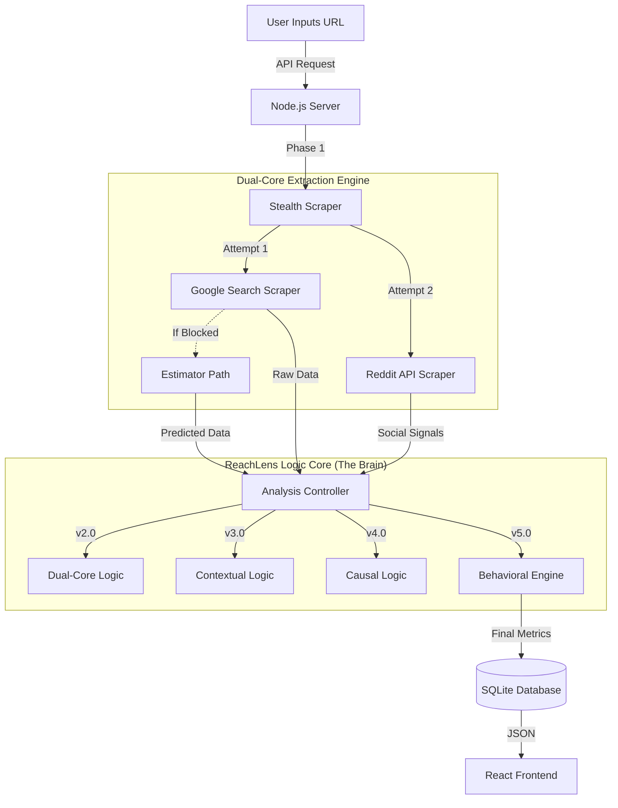

# 🦅 ReachLens: The Agentic Intelligence Engine

  

> **"Stop counting clicks. Start measuring influence."**

**ReachLens** is a sophisticated analytics platform designed for the **AI Era**. Most PR tools just scrape "Domain Authority" and multiply it by generic traffic numbers. ReachLens goes deeper—using **Causal AI** to understand *why* content is spreading and **Agentic Logic** to predict if AI Agents (like Perplexity or Gemini) are consuming your content.

---

## 🏗️ System Architecture

How does ReachLens turn a simple URL into high-fidelity intelligence?



---

## 🔮 The Time Machine: 4 Generations of Logic

ReachLens allows you to toggle between **4 distinct mathematical models** to see how reach calculation has evolved.

| Version | Name | Philosophy | Key Features | Best For |
| :--- | :--- | :--- | :--- | :--- |
| **v2.0** | **Dual-Core** | *"Trust but Verify"* | • Verified Search Count<br>• Linear Time Decay (-20%/week) | **Baseline Reporting**<br>Conservative, "old-school" PR metrics. |
| **v3.0** | **Contextual** | *"Location Matters"* | • **Heat Map:** Hero links worth 2x<br>• **Industry Scaling:** Tech/Ent multipliers | **Accuracy**<br>Distinguishing between a headline feature and a footer link. |
| **v4.0** | **Causal** | *"Why is it viral?"* | • **Sentiment Analysis:** Controversy = 1.5x Reach<br>• **Sigmoid Cliff:** Reach crashes after Day 4 | **Impact Analysis**<br>Understanding the "quality" of the coverage. |
| **v5.0** | **Agentic** | *"The Future"* | • **Agentic Gatekeeper:** AI Citations = Gold Badge<br>• **Frozen Decay:** Perpetual traffic tail<br>• **SISI:** Social Influence Strength Index | **2026+ Strategy**<br>Optimizing for AI Agents, not just humans. |

---

## 📂 Project Anatomy

Understanding the codebase structure in `e:/MAVERICKS/wizikey`.

### `/server` (The Brain)
-   **`src/services/ScraperService.ts`**: The eyes of the system. Uses `puppeteer-extra-plugin-stealth` to evade bot detection and scrape Google.
-   **`src/services/ReachEstimator.ts`**: The core CPU. This single file contains all the math for v2, v3, v4, and v5. **Edit this to tune the algorithm.**
-   **`src/controllers/AnalysisController.ts`**: The conductor. Receives the request, picks the version, calls the scraper, and saves results.
-   **`reachlens.db`**: A local SQLite database storing every snapshot.

### `/client` (The Face)
-   **`src/components/Dashboard.tsx`**: The main command center. Handles the "Version Toggle" state.
-   **`src/components/StatsCard.tsx`**: Reusable UI component for displaying "Agentic Rank", "Reach", etc.
-   **`src/api.ts`**: The bridge between Client and Server.

---

## 🚀 Quick Start Guide

### 1. Prerequisites
-   **Node.js**: v18 or higher.
-   **NPM**: Installed automatically with Node.

### 2. Installation
Open your terminal and run:

```bash
# Clone or Download the project
cd e:/MAVERICKS/wizikey

# Install Backend
cd server
npm install

# Install Frontend
cd ../client
npm install
```

### 3. Running the Engine
You need **two** terminal windows open.

**Terminal 1 (Backend):**
```bash
cd server
npm start
# Server runs on http://localhost:3000
```

**Terminal 2 (Frontend):**
```bash
cd client
npm run dev
# Dashboard opens at http://localhost:5173
```

---

## 🔧 Troubleshooting

### "The screen is blank!"
-   **Cause**: Usually a Backend connection error or a UI bug.
-   **Fix**: Check the Console (F12) for errors. If it says `Network Error`, ensure the Server is running on port 3000.

### "Scraping Failed / CAPTCHA Detected"
-   **Cause**: Google has flagged the IP.
-   **Fix**: The system automatically switches to the **Estimator Path** (v2 logic) as a fallback. You will see "Confidence: 65%" in the UI.

### "Agentic Rank is Gray"
-   **Cause**: The URL was not cited by a major AI engine (Perplexity, Gemini, etc.).
-   **Fix**: Try a URL from a major tech blog or high-ranking Wikipedia article to see the "Gold" badge.

---

## 📝 Developer Notes

-   **Database**: The SQLite DB is created automatically at `server/reachlens.db`. You can view it with any SQLite viewer.
-   **Env Vars**: Create a `.env` in `/server` if you need to change the port (default 3000).

---

*Built with ❤️ by the Antigravity Team | 2026*
